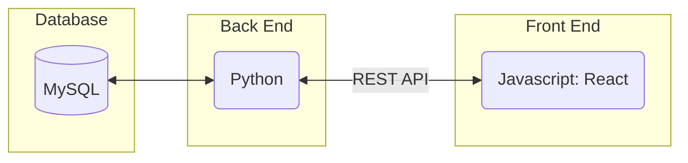
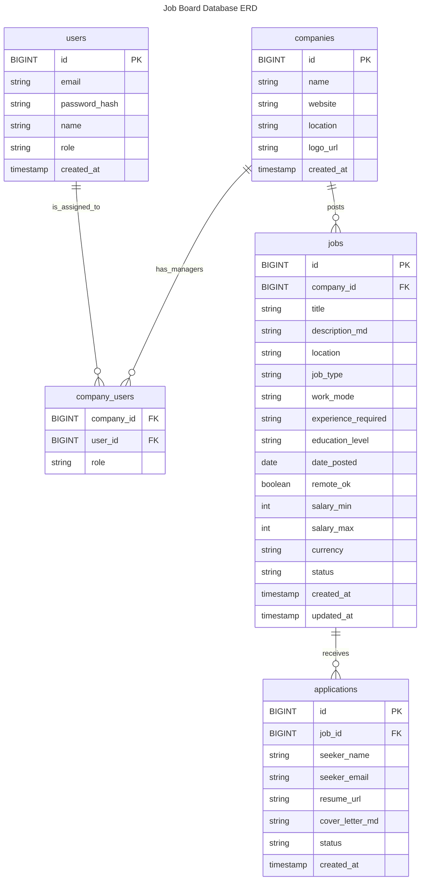
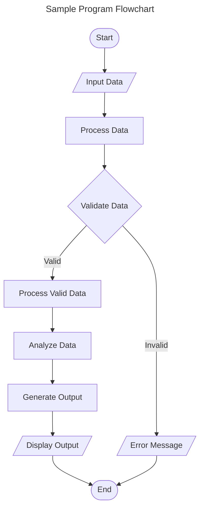
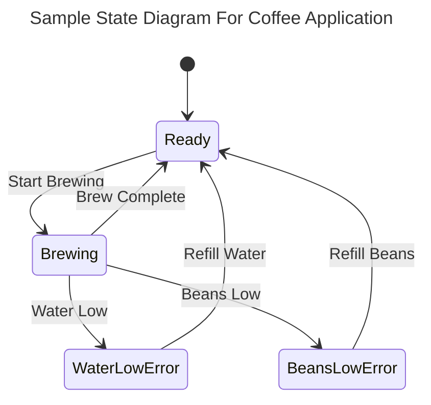
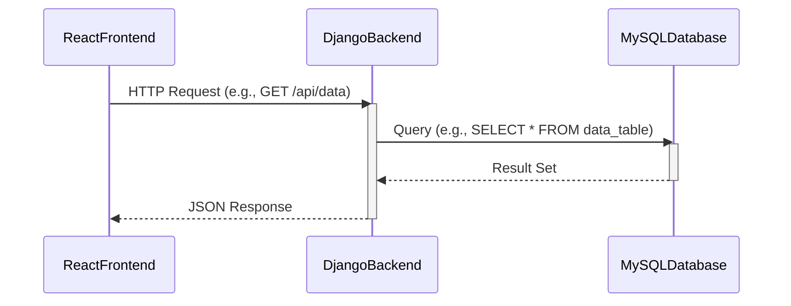

# Specification Document

### Project Abstract

Our project is meant to be a functioning job board similar to Indeed and LinkedIn. The board will either pull existing jobs/positions from a public API or the users will be able to add positions to the board which will be stored via a database. Users will also be able to filter positions by certain specifications as well as search. The board might also potentially have a login system so users will be able to login and view their applied jobs and potentially the status of applications as well. 

### Customer

Any person who is looking for a job/intern position. The product will be able to help aid those who are searching in potentially finding positions that match what they are looking for as well as track their efforts.

### Specification

<!--A detailed specification of the system. UML, or other diagrams, such as finite automata, or other appropriate specification formalisms, are encouraged over natural language.-->

<!--Include sections, for example, illustrating the database architecture (with, for example, an ERD).-->

<!--Included below are some sample diagrams, including some example tech stack diagrams.-->

https://www.figma.com/design/OOJt9HEn9SddZREkRkMvNj/CS506-Project?node-id=0-1&t=9z6vuMMJKrb4pN44-1

#### Technology Stack

Here are some sample technology stacks that you can use for inspiration:

#### Class Diagram

#### Flowchart

#### Behavior

#### Sequence Diagram

